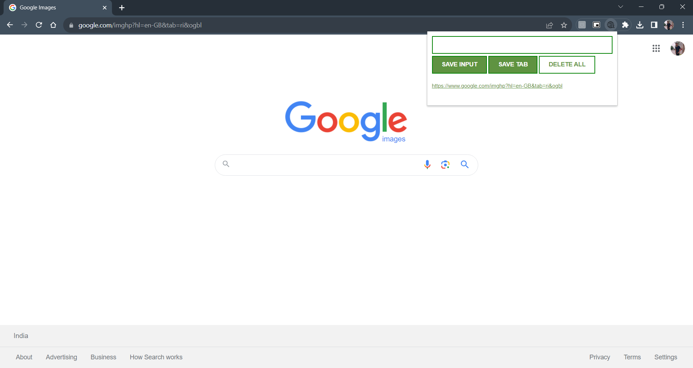

 
# Website-Bookmarker-Extension: 

**_Google Chrome Extension to bookmark the websites._**

Here is the sample of the Chrome Extension: 👇👇

Steps to the extension add to your browser: 🧩🧩
    1. Download the repository as a zip file.__(Repository < Code < Download ZIP)__
    2. After Downloading the repository extract the files out of it.
    3. Now open your chrome browser and go to [Google Chrome Extension Website](chrome://extensions/)
    
    4. Check on the **Developer Mode** on top right cornor.
    5. Now click on the option **Load Unpacked** and select the unziped folder.
    6. Finally your extension will be added to your Browser.
